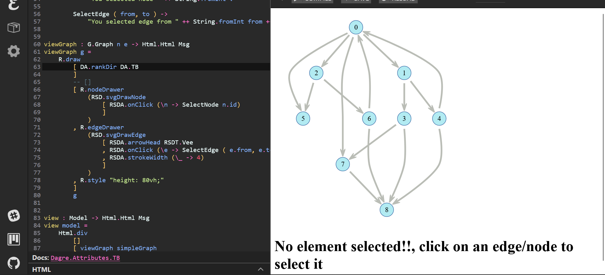
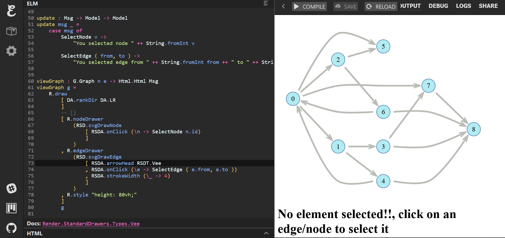

# Elm-dagre Tasks

1. Dagre Module: The main graph layout algoithm
2. Render Module: Uses Dagre to draw graph

### 1. Dagre Module Attributes

The Dagre.Attribute contains types and functions to set the attributes corresponding to each algorithm.

Common constraint:
-  All numeric attributes can not have values < 0. If a value `v` < 0
    then absolute value of `v` is used.
-  All numeric values are defined in pixels.

Some Common attribute:
- **rankDir** : It represents graphs directions.T,L,B,R represent Top, Left, Bottom, Right respectively.TB represent Top to Bottom direction. Similar notation is
used for other directions.

- **widthDict** : It associated the nodes with its width that will be used during rendering of graph.

- **heightDict** : Same as width but sets the height.

- **width** : The default value will be used when no value is available in widthDict for some node.
- **height** : Similar as width.
- **nodeSep** : It defines the separation value between nodes in same layer(rank).

- **edgeSep** : It defines the edge separation between the edges of same hierarchy.

- **rankSep**:  It defines the separation between the nodes of different layer(rank).

- **marginY** : It specifies the top and bottom margin.

- **marginX** : It defines the left and right margin.

*More details can be found in the documentation.*

### 2. Render.draw working
1. Uses D.run_layout with the optional Dagre attributes and graph to return width, height and coordDict and points Dict. Theses configuration will be used by edgeDrawer and nodeDrawer.
2. Then corresponding to each nodes and edges "edgeDrawer" and "nodeDrawer" with the given configuration returns the type SVG for each node.
3. This is used to generate the HTML msg to draw graphs.

### 3. Working of optional Dagre and Render attribute
  The dagre optional attribute are passed as list of functions that changes a record to return a new one. List.foldr is uesd to take an default config and repeatedly apply these function to get the record that contain the desired configuration.
  This configuration is used in all nodes and edges via List.map.

### 4. How does the computed layout send to drawers
  Corresponding to each edge/nodes related information is mapped to the typed SVG via the edge drawer or node drawer  with the configuration that we passed.

### 5. What are StandardDrawer.attributes

  StandardDrawer attribute are the attribute that can be used to change the display property of nodes and edges. 
  Some of the Edges Attributes are:
  - **arrowHead** : This denotes whether the edge is directed or not.
  
  
  
  

  
  
  - **strokeColor** : This denotes the color of the edge.
  
  

  

  - **strokeWidth**: This denotes the thickness of the edge.
  
  

  

  Some of the Node Attributes are:
  - **shape**: Takes limited shape type to give it to node.
  
  
  - **fill**: It is the fill color of the node.
  
  

  * Other attributes details can be referred inside the code for each attribute. *

### 6. Why are Dagre and Render attributes separated
-  Dagre attribute are related to how the graph are presented and how they are spaced. They are intrinsically associated with algorithm that are used to draw graph like its spacing, how the nodes of each layer is layed out. 
-  Render attributes contains the decorative attributes in drawing graphs, to present then on screen 
- Since these attributes are not needed by the algorithm they are form a separated modules. Another reason for separation is flexiblity, now since dagre and render are separated we can easily change the dagre and render module with new module without breaking the code. 
